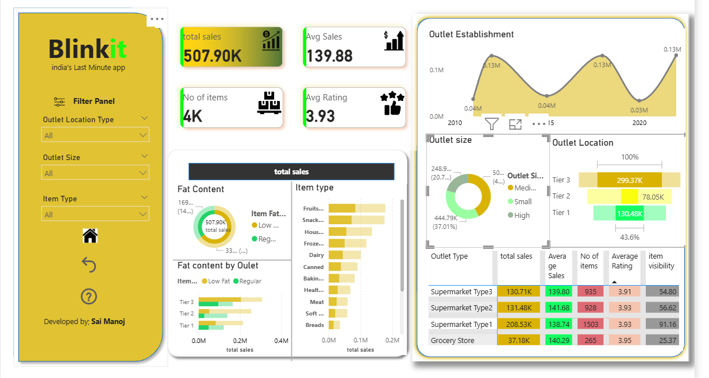

# 🟡 Blinkit Sales & Outlet Performance Dashboard

> An interactive **Power BI dashboard** analyzing Blinkit's grocery sales and outlet performance across locations, outlet sizes, and item categories — covering sales trends from **2010 to 2020**.

---

## 📌 Table of Contents

- [Overview](#-overview)
- [Dashboard Previews](#-dashboard-previews)
- [Blinkit Dashboard](#-dashboard)
- [KPIs Tracked](#-kpis-tracked)
- [Key Insights](#-key-insights)
- [Dataset](#-dataset)
- [Tools Used](#-tools-used)
- [Files in this Repo](#-files-in-this-repo)
- [How to Use](#-how-to-use)
- [Author](#-author)

---

## 📖 Overview

This project delivers a fully interactive Power BI dashboard built on **BlinkIT Grocery Data**, providing business intelligence across:

- 🏪 **Outlet performance** — by type, size, and location tier
- 🛒 **Item-level sales analysis** — by category and fat content
- 📅 **Sales trends** from 2010 to 2020
- ⭐ **Customer ratings** and satisfaction metrics
- 🔍 **Drill-down filters** for outlet size, location, and item type

**Use Case:** Helps business analysts and stakeholders identify top-performing outlets, high-demand item categories, and growth opportunities across Blinkit's grocery network.

---

## 📸 Dashboard Previews

### 💰 Sales Overview
This view displays the **total sales performance** across all outlets. It includes a donut chart breaking down sales by **fat content** (Low Fat vs Regular), a bar chart showing **sales by item type** (Fruits, Snacks, Household, Dairy, etc.), and a stacked bar comparing **sales by outlet type** (Supermarket Type 1/2/3 and Grocery Store). The top KPI cards show Total Sales, Average Sales, Number of Items, and Average Rating at a glance.

---

### 📦 Items Analysis
This view focuses on **item-level performance**, showing the number of items sold per category using horizontal bar charts. It highlights which item types (e.g. Fruits & Vegetables, Snack Foods, Frozen Foods) have the highest item counts and visibility across outlets, helping identify which categories drive volume vs. revenue.

---

### 📊 Average Sales Performance
This view presents **average sales per outlet** broken down by outlet size (Small, Medium, High) and outlet location tier (Tier 1, Tier 2, Tier 3). A line chart tracks the **year-on-year sales trend** from 2010 to 2020, making it easy to spot peak performance years and growth patterns across outlet categories.

---

### ⭐ Customer Ratings
This view shows the **distribution of average customer ratings** across different outlet types and item categories. Ratings are visualised using bar and gauge charts, with most outlets scoring consistently between **3.9 and 4.0**, indicating generally stable customer satisfaction regardless of outlet size or location tier.

---

### 🔍 Filter Panel
This is the **interactive slicer panel** that allows users to dynamically filter the entire dashboard. It includes slicers for **Outlet Location Type** (Tier 1 / 2 / 3), **Outlet Size** (Small / Medium / High), **Item Type**, and **Outlet Type**. All visuals across every page update in real time when filters are applied.

---

## 📸 Blinkit Dashboard



## 📈 KPIs Tracked

| KPI | Description |
|---|---|
| **Total Sales** | Overall revenue generated across all outlets |
| **Average Sales** | Mean sales per outlet / item category |
| **Number of Items** | Total distinct grocery items tracked |
| **Average Rating** | Mean customer satisfaction rating per outlet |
| **Sales by Fat Content** | Low Fat vs Regular item sales split |
| **Sales by Outlet Type** | Supermarket Type 1 / 2 / 3 vs Grocery Store |
| **Sales by Outlet Size** | Small, Medium, High outlet performance |
| **Sales by Location Tier** | Tier 1, Tier 2, Tier 3 city-level comparison |
| **Outlet Establishment Trend** | Year-wise outlet growth from 2010–2020 |

---

## 💡 Key Insights

- 📈 Sales show consistent growth from 2010 to 2020 with a notable peak around **2018**
- 🏪 **Supermarket Type 1** outlets generate the highest total sales volume
- 🥗 **Low Fat items** outsell Regular items across most categories
- 🌆 **Tier 3 locations** contribute surprisingly high sales despite lower city tier
- 📦 **Fruits & Vegetables** and **Snack Foods** are the top-selling item categories
- ⭐ Average customer rating remains consistently around **3.9 – 4.0** across all outlet types
- 🏬 **Medium-sized outlets** perform better than Small and High-sized ones overall

---

## 📊 Dataset

**File:** `BlinkIT Grocery Data.xlsx`

| Column | Description |
|---|---|
| `Item Identifier` | Unique ID for each grocery item |
| `Item Type` | Category (Fruits, Snacks, Dairy, Frozen Foods, etc.) |
| `Item Fat Content` | Low Fat / Regular |
| `Item Visibility` | Shelf space percentage allocated to the item |
| `Item MRP` | Maximum Retail Price |
| `Outlet Identifier` | Unique outlet ID |
| `Outlet Size` | Small / Medium / High |
| `Outlet Location Type` | Tier 1 / Tier 2 / Tier 3 |
| `Outlet Type` | Grocery Store / Supermarket Type 1 / 2 / 3 |
| `Outlet Establishment Year` | Year the outlet was opened (2010–2020) |
| `Item Outlet Sales` | Target variable — actual sales figure |

---

## 🛠 Tools Used

| Tool | Purpose |
|---|---|
| **Power BI Desktop** | Dashboard creation and interactive visualisations |
| **Microsoft Excel** | Source data in `.xlsx` format |
| **blinkit.json** | Custom Blinkit-branded colour theme for Power BI |
| **DAX** | Calculated KPI measures and dynamic aggregations |
| **Word (Docx)** | Written analysis report of findings |

---

## 📁 Files in this Repo

```
Blinkit_dashboard/
│
├── 📊 powerbi dashboard.pbix      # Power BI report — open in Power BI Desktop
├── 📄 blinkit.json                # Custom Power BI colour theme (Blinkit branding)
├── 📋 Blinkit Analysis.docx       # Written analysis document with findings & insights
├── 📂 BlinkIT Grocery Data.xlsx   # Raw grocery sales dataset (2010–2020)
│
├── Sales.png                      # Sales overview screenshot
├── Items.png                      # Items analysis screenshot
├── Avg Sales.png                  # Average sales per outlet screenshot
├── rating (1).png                 # Customer ratings screenshot
├── filter.png                     # Filter panel screenshot
└── background kpi.png             # KPI background design asset used in dashboard
```

---

## 🚀 How to Use

### Step 1 — Install Power BI Desktop
Download for free from [powerbi.microsoft.com](https://powerbi.microsoft.com/en-us/desktop/)

### Step 2 — Open the Dashboard
1. Clone or download this repository
2. Open `powerbi dashboard.pbix` in Power BI Desktop

### Step 3 — Apply the Custom Theme *(Optional)*
1. In Power BI Desktop go to **View → Themes → Browse for themes**
2. Select `blinkit.json` from this repo
3. The Blinkit yellow-green colour scheme will be applied instantly

### Step 4 — Connect to Data *(if data path breaks)*
1. Go to **Home → Transform Data → Data Source Settings**
2. Update the file path to point to `BlinkIT Grocery Data.xlsx` on your machine
3. Click **Close & Apply**

### Step 5 — Explore & Filter
Use the filter panel to slice data by:

| Filter | Options |
|---|---|
| Outlet Location Type | Tier 1 / Tier 2 / Tier 3 |
| Outlet Size | Small / Medium / High |
| Item Type | Fruits, Snacks, Dairy, Frozen Foods, etc. |
| Outlet Type | Grocery Store / Supermarket Type 1 / 2 / 3 |

---

## 👤 Author

**Sai Manoj Ranga** — [@Sai-manoj-ranga](https://github.com/Sai-manoj-ranga)

---

*Built with Power BI 📊 | Powered by Data Analytics*
